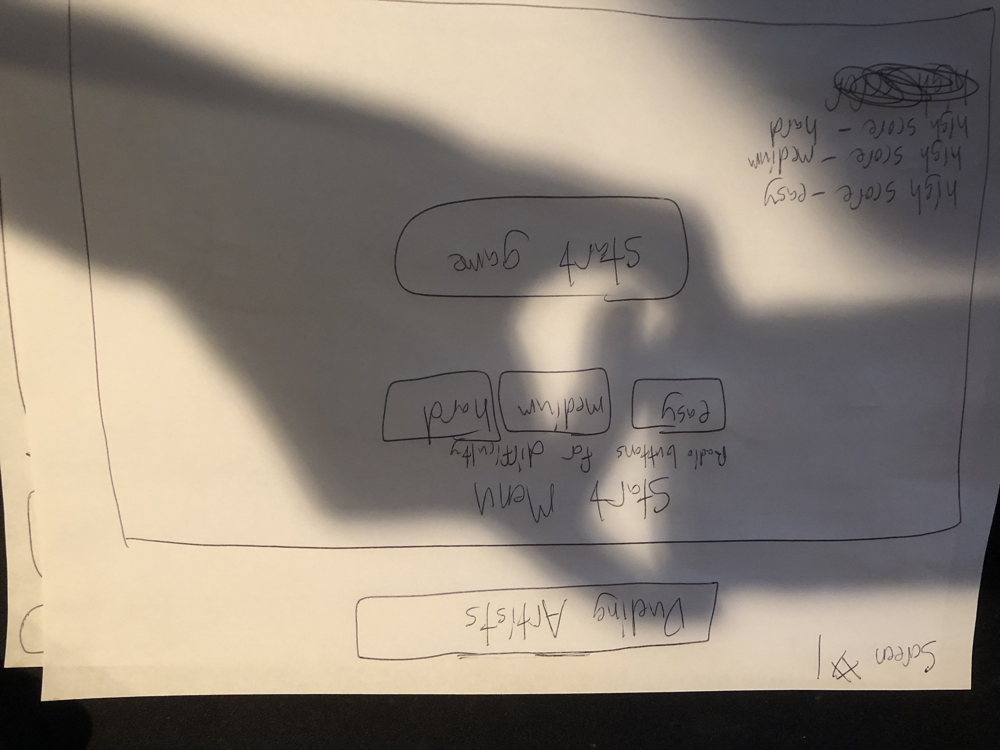
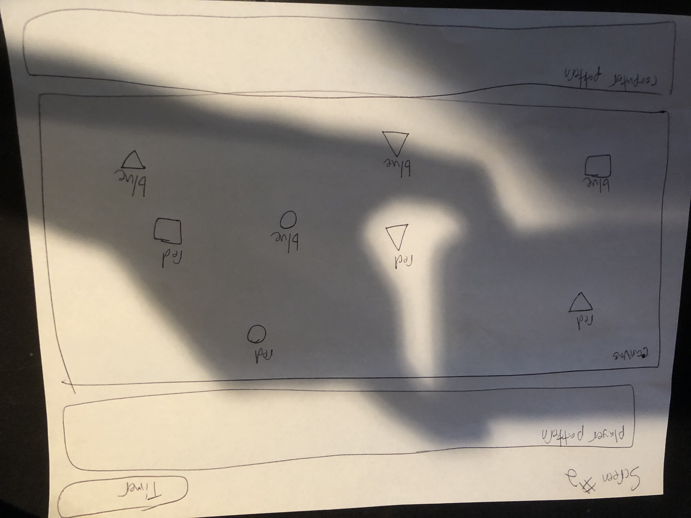

# Simon's Ship Shapes

Description: Using memorization, match the given pattern of different colored shapes.

Wireframes:

MVP: A start screen with a button to begin the game. On clicking the button, the game board appears. Different colored squares, circles, and triangles render at random spots and bounce off the canvas borders. A randomly generated array of these objects (displayed to the player for a few seconds) serves as the opponent. On click, the player must select the same objects in the same order. Matching player and computer arrays is the win condition. Mismatched arrays is the loss condition. A play again button to return to the start screen.

Stretch Goals:

  Achieved:
    Display the player selections in a separate canvas
    Add simple visuals like shadows to the moving shapes
    Display computer choices as shapes- not just as words
    
  Not achieved:
    Fix "hitbox" of circles and triangles
    Fix border collision on left and top sides for triangles and squares
    Connect the timer to a loss condition
    Different difficulty settings: less time, more shapes in computer pattern, shapes move faster
    Sound effects on click
    Background music
    Pirate theme via CSS!!!!!
    Prevent shapes from spawning on top of one another
    Change play again button so it doesn't have to refresh the page
    
Technologies used: HTML, CSS, Javascript
